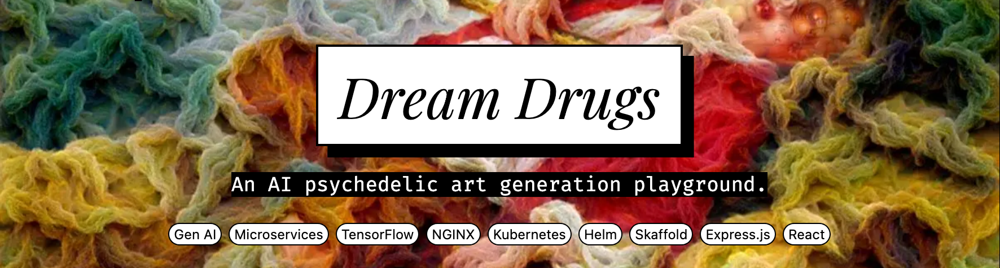

  <picture>
    <source media="(prefers-color-scheme: dark)" srcset="./hero-dark.png" />
    
  </picture>

  
  

Expose the patterns from your neural network layers to turn your own pictures
(uploaded or webcam) into artistic hallucinations. Extend the existing models by writing your own as a **Python module** (check the
[base model](./backend/dreamdrugs/_base.py) to see how they look like).

## Architecture

The system is built to be **scalable**, using `Kubernetes` and `Helm` for
orchestration and deployment.

The **frontend** is a `React` application served—alongside a lightweight
**frontend API**—by an `Express` server. The **backend** is a `Python` +
`TensorFlow` app, exposed via a `Flask` server running on `Gunicorn`.

For realtime communication, both services interact through a `Redis` cluster
(**PUB-SUB**) deployed as a Helm chart dependency.

To **minimize ingress costs**, I deployed an array of `NGINX` servers as a
`DaemonSet`, with repeated DNS entries pointing to each node. This allows
incoming requests to be load-balanced across the cluster without requiring a
cloud-managed ingress controller.

The system is built to be **extensible**—new models can be plugged in easily to
generate different kinds of hallucinations.

<table class="github-only">
  <tr>
    <td></td>
    <td></td>
  </tr>
  <tr>
    <td></td>
    <td></td>
  </tr>
</table>

## Guides

On the [Wiki](../../wiki) there's detailed documentation on:

| Document                                                                                                                | Explains How To...                                                                                                                      |
| ----------------------------------------------------------------------------------------------------------------------- | --------------------------------------------------------------------------------------------------------------------------------------- |
| [Local Development](../../wiki/Local-Development)                                                                       | Use Rancher Desktop with Skaffold for local Kubernetes development, with hot-reloading. Also explains how to debug Python.              |
| [Production Setup](../../wiki/Production-Setup)                                                                         | Deploy the project to GKE cheaply using Cloudflare for DNS and SSL, and includes setup steps for GCP, the cluster, and Helm deployment. |
| [Proxying: Ingress (Traefik) or DaemonSet with NGINX](<../../wiki/Proxying:-Ingress-(Traefik)-or-DaemonSet-with-NGINX>) | Customize how to route your requests from the cluster into the pods.                                                                    |
